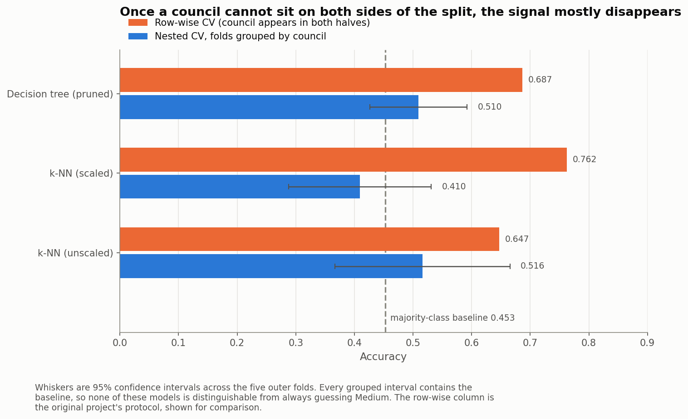
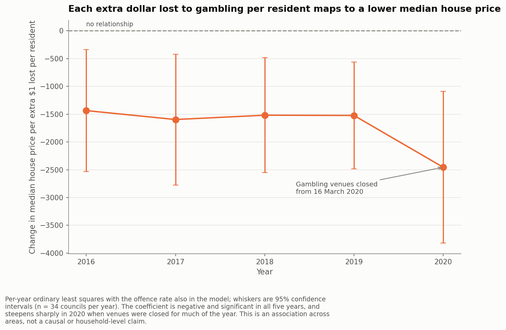
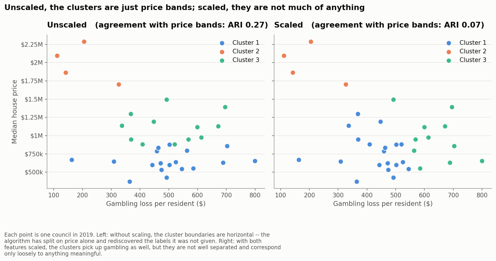

# Victorian House Prices vs. Crime and Gambling

**Do criminal offence rates and gambling losses predict median house prices across Victoria's Local Government Areas?** A 2024 university group project, rebuilt in 2025 as a reproducible, parity-tested pipeline — and re-audited, which changed the answer.


---

## In short

- **The rebuild is verified, not just tidied.** A 14-test parity suite proves the refactored pipeline reproduces the original 2024 outputs **to the cent** — 374 house-price rows, 350 gambling rows and 395 offence rows with zero differing values — before any analysis changed. One bug fix is isolated in its own commit, with tests asserting it altered a label and no arithmetic.
- **The original silently dropped a council.** Moreland was renamed Merri-bek in 2022, and the crime extract used the new name while the other two sources used the old one. The three-way join matched nothing for it. Fixing one dictionary entry restored **165 → 170 rows, 33 → 34 councils**.
- **The headline result does not survive honest validation.** The dataset is a panel: 34 councils × 5 years, where **97% of the crime variance is *between* councils** and **25 of 34 councils never change price band**. The original split rows at random, so near-copies of every test row sat in training. With folds grouped by council, accuracy falls from **0.65 to 0.516** against a **0.453** majority baseline — and every confidence interval contains the baseline.
- **One finding does survive, as description rather than prediction.** Gambling loss per resident is negatively associated with house prices, significant in **5 of 5 years** (crime: **0 of 5**), and the relationship steepens **71%** into 2020, when venues were closed from 16 March.

> *My role: data loading and preprocessing, the K-means strand, the limitations analysis, repo and coordination — see [My contribution](#my-contribution). The 2025 rebuild is mine alone.*

---



*Every model lands within noise of the majority-class baseline once a council cannot appear on both sides of the split. The orange bars are the original project's protocol.*

## Key results

Three columns, because the distinction matters: what the report measured, what it measures when reproduced consistently, and what survives when the model is tested on councils it has never seen.

| | As submitted (2024) | Reproduced (170 rows, seeded) | **Held out (grouped by council)** |
|---|---|---|---|
| Majority-class baseline | *not computed* | 0.4529 | **0.4529** |
| k-NN, unscaled | "about 72%" | 0.6471 | **0.5162** ± 0.17 |
| k-NN, scaled | *not tried* | 0.7621 | **0.4095** |
| Decision tree, pruned | 0.7424 *(omitted from report)* | 0.6868 | **0.5095** |
| Regression R², gambling + crime | *r = 0.484* | R² = 0.2095 | **R² = 0.0281** |
| Regression R², crime only | *r = 0.026* | R² = 0.0002 | **R² = −0.1929** |

Sources: [`results/model_comparison.csv`](results/model_comparison.csv), [`results/regression_summary.csv`](results/regression_summary.csv), [`results/knn_k_sweep.csv`](results/knn_k_sweep.csv). Every number in this README traces to a committed file — see [`results/README.md`](results/README.md).

A negative held-out R² means the model is worse than predicting the mean.

### How to read the gap between those columns

The submitted report's correlation and RMSE figures are **in-sample fits** — the models were scored on the data they were trained on. That is normal for an introductory subject, and the numbers are correct for what they measure; they measure *fit*, not *prediction*. This rebuild keeps every original number verbatim for traceability and reports a held-out equivalent beside it. Where the two disagree, **the held-out number is the one to believe**.

On that basis: the report's *descriptive* conclusion about gambling holds up and is now backed by significance tests it did not have. Its *predictive* claim does not.

---

## The question and the data

Across Victoria's councils, is there a relationship between what residents lose on poker machines, how much crime is recorded, and what houses cost? The analysis covers **2016–2020**, the overlap of all three sources.

| Source | Publisher | Shape | Used for |
|---|---|---|---|
| `Houses-by-suburb.csv` | Victorian Government | 786 localities × 2013–2023 | Median house price per suburb |
| `EGM.csv` | Victorian gambling regulator | 57 reporting areas × 2011–2020 | Electronic gaming machine losses |
| `LGA Offences.xlsx` | Crime Statistics Agency Victoria | 53k rows × 8 sheets | Offence counts and rates per LGA |
| `communities.csv` | Victorian Government | 1,080 communities × 226 cols | Suburb→LGA mapping, population |

Provenance and licensing notes are in [`data/README.md`](data/README.md); the publishers' own documentation is preserved in `data/raw/README_*.txt`.

## Method

```
data/raw/                 build steps                    data/processed/
─────────                 ───────────                    ───────────────
communities.csv ──┬──► build_houses   ─── population-weighted ──► houses_by_lga.csv
Houses-by-suburb ─┘                       median price

communities.csv ──┬──► build_egm      ─── split 11 composite ───► egm_by_lga.csv
EGM.csv ──────────┘                       areas, convert to
                                          dollars per resident

LGA Offences.xlsx ───► build_offences ─── sum subdivision ──────► offences_by_lga.csv
                                          rates, normalise
                                          council names
                                                │
                                                ▼
                            build_dataset ─ inner join on (LGA, Year)
                                            + Low/Medium/High bands
                                                │
                                                ▼
                                    modelling_dataset.csv  (170 × 13)
                                                │
                              notebooks/01 … 04 ─► figures/ + results/
```

Three choices are worth stating because they are not obvious:

- **House price is population-weighted across suburbs**, and a suburb with no recorded price that year is excluded from both the numerator and the denominator. Weighting by share of population is a proxy for share of housing stock; the two diverge in newly built outer suburbs.
- **Offence rate is the sum of per-subdivision rates.** This is valid because the Crime Statistics Agency publishes every subdivision's rate against the same council population denominator, so the sum reconstructs the total.
- **Population is a 2012 estimate, used for every year.** The source offers only 2007 and 2012. Extrapolating from two points eight years out is not obviously better than holding the last known value — see [`figures/05_population_estimate_error.png`](figures/05_population_estimate_error.png) — so the error is systematic and acknowledged rather than invented.

---

## What the re-run changed

| # | Defect in the original | Effect | Fix |
|---|---|---|---|
| 1 | Row-wise splits on panel data | Four near-copies of each test row in training; accuracy inflated by ~13 points | `StratifiedGroupKFold` grouped by council, with nested model selection |
| 2 | Features never scaled, despite a 20× magnitude gap | k-NN was effectively a one-feature model — which is why the report's own ablation showed gambling alone scoring near baseline | `StandardScaler` pipeline, both variants reported |
| 3 | Council rename unhandled (`Merri-bek` / `Moreland`) | One council silently dropped from every model | One entry in `LGA_RENAMES`; 165 → 170 rows |
| 4 | No random seeds anywhere | Headline accuracy not reproducible | Single `SEED` in `config.py`, threaded through everything |
| 5 | Regressions fitted and scored on the same rows | Reported fit, described as prediction | Held-out estimates reported beside in-sample ones |
| 6 | No R², MAE, p-values or baselines | "0.66 accuracy" and "r = 0.48" had nothing to be judged against | All added; baselines on every chart |
| 7 | Three regressions fitted on two different samples | The report's comparison table was not like-for-like | All models now fitted on the same 170 rows |
| 8 | `OrdinalEncoder` applied to continuous features | Turned rates into meaningless rank indices | Dropped; tree fitted on raw rates |
| 9 | K-means unscaled and unseeded, reading a stale hand-made file | Clustered on price alone; irreproducible | Rebuilt on the pipeline output, seeded, scaled variant added |

Defect 7 is a consequence of defect 3: the gambling-only regression never touched the offences table, so it never hit the name mismatch and kept the council the other two lost. It was fitted on 34 councils while its comparators used 33.

---

## What we actually found



*The one result that holds up. Each extra dollar lost per resident corresponds to roughly $1,400–$2,500 off the median house price, significant in every year.*

Areas where more is lost per resident on poker machines have **lower median house prices**. The association is consistent across all five years and statistically clear (p < 0.05 in 5/5 years); recorded crime shows nothing comparable (0/5). The coefficient steepens 71% into 2020 — the year gambling venues closed from 16 March — though with n = 34 councils per year the confidence intervals for 2016 and 2020 overlap, so that steepening is suggestive rather than established.

**This is an association across areas, not a causal claim and not a household-level one.** Household income is an obvious common cause of both, and nothing in this data can separate that from the alternatives. Inferring anything about individual gamblers from council-level averages would be an ecological fallacy.

## What didn't work



K-means clustering was my strand of the original project, and I abandoned it. My note at the time read: *"Doesn't really make sense to apply K-means clustering, as the y-axis is dependent on x."*

The call was right; the reason was not quite. House price and gambling loss differ in variance by about **seven orders of magnitude**, so unscaled K-means was clustering on price and nothing else. The proof is one number: the unscaled two-feature clustering agrees with a clustering built on the price column alone at **ARI = 1.00**. The gambling feature contributed literally nothing.

Scaling fixes that in one line — and does not rescue the method. The scaled clusters finally use both features but are poorly separated (silhouette 0.37), because Victoria's councils lie along a continuum rather than falling into natural groups. Clustering is the wrong tool for a continuum, and no preprocessing changes that. [`notebooks/04_kmeans.ipynb`](notebooks/04_kmeans.ipynb)

## Limitations

- **34 independent units.** 170 rows overstates it; the effective sample is 34 councils. Every confidence interval here is wide and the honest accuracy estimates carry a standard deviation of ~0.17.
- **Population is a 2012 estimate applied to 2016–2020.** Systematic, not random, and it propagates into all three per-capita measures.
- **Eleven gambling reporting areas cover more than one council**, and are split in proportion to population — so members of a group receive *identical* losses per head by construction. Whittlesea and Nillumbik are such a pair, making 10 of 170 rows collinear in that feature. Flagged in the data as `EGM Split`.
- **Crime per resident misstates commuter districts.** The City of Melbourne's offence rate counts offences against a daytime population but divides by residents. It dominates the regression on Cook's distance, and removing it flips the sign of the crime coefficient — the weak positive crime–price association in the full sample is a CBD artefact.
- **Gambling means poker machines only.** Casino, racing and online betting are excluded, so the measure understates gambling in the City of Melbourne far more than in a country town.
- **The price bands are domain-chosen, not data-driven.** $600k/$1M came from the 2024 report. The $600k boundary falls where the price distribution is densest, which is why the Low class is hardest to classify.

---

## Reproduce it

Requires Python 3.11+ (3.13 verified). From the repository root:

```bash
python -m venv .venv
.venv/Scripts/python -m pip install -r requirements.txt -e .   # Windows
# .venv/bin/python -m pip install -r requirements.txt -e .     # macOS / Linux

.venv/Scripts/python -m pytest -q          # 14 parity tests, ~2 s
.venv/Scripts/python -m vichouse.pipeline  # rebuild every processed table, ~20 s
```

The pipeline reads a committed CSV cache of the 19.7 MB crime workbook, so a fresh clone runs without opening it. Pass `--refresh-offence-cache` to rebuild that cache from the raw source and prove the whole chain.

Versions are pinned with `==` rather than `>=` on purpose: the parity suite asserts the pipeline reproduces 2024 outputs to the cent, and that claim is only meaningful against a fixed library set.

## Repository

```
data/raw/          the four source datasets, verbatim, plus publisher docs
data/interim/      CSV cache of the one workbook sheet used
data/processed/    generated tables, committed so they are browsable here
src/vichouse/      the pipeline: config, naming, load, four builders, modelling, plotting
notebooks/         01 EDA · 02 classification · 03 regression · 04 clustering
tests/             parity suite; tests/reference/ holds the frozen 2024 outputs
figures/           15 PNGs, regenerated by the notebooks
results/           one CSV per claim made above
report/            the submitted PDF and a transcription of its tables
archive/           the original scripts and superseded notebooks, with provenance
```

## Credits

**COMP20008 Assignment 2, University of Melbourne, 2024 — Group W05G1**

Emerson Leishman · **Jason Jiang** · Benedict Yong · Zhengrong Yan

The original submission is preserved at [`report/COMP20008_A2-Report.pdf`](report/COMP20008_A2-Report.pdf), and its tables are transcribed in [`report/ORIGINAL_RESULTS.md`](report/ORIGINAL_RESULTS.md). The group's analysis, research question and data selection are shared work and the report was written collectively.

<a name="my-contribution"></a>
### My contribution

In the original 2024 project:

- **Data loading and preprocessing** — `data.py` (the shared loader, suburb→LGA mapping, population derivation) and `houses_by_lga.py` (the population-weighted house price), now `src/vichouse/load.py` and `build_houses.py`.
- **K-means clustering** — `Jason.ipynb`, now [`notebooks/04_kmeans.ipynb`](notebooks/04_kmeans.ipynb), including the decision to abandon it.
- **Co-authored the written report**, and drove the limitations and critique sections.
- **Set up and maintained the shared repository** and integrated the team's work.

The 2025 rebuild — the restructure, the parity suite, the dropped-council fix, seeding, grouped cross-validation, baselines, the significance testing, the figures and this README — **is mine alone**.

I have left every original number intact rather than quietly replacing it. The most useful thing I learned here was found by auditing my own group's work: that a respectable-looking accuracy on panel data can be mostly leakage, and that the way to find out is to ask what the model scores on a unit it has never seen.

---

*Data is published by Victorian Government agencies and used under their original terms; see [`data/README.md`](data/README.md). The code in this repository is MIT licensed.*
